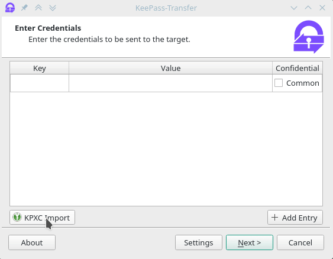
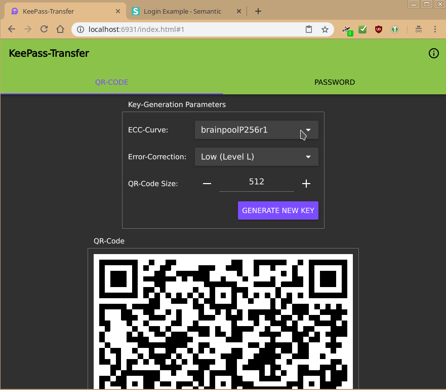
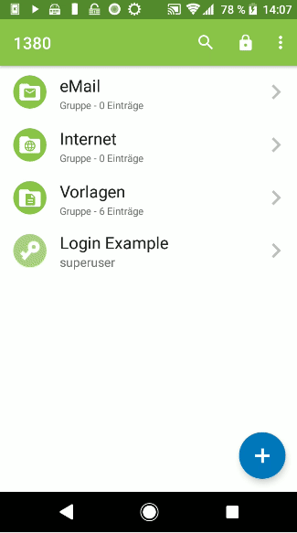

# KeePass-Transfer
A collection of tools to securely transfer passwords to your browser. You transfer passwords from desktop and your mobile phone, with integrations for [KeePassXC](https://github.com/keepassxreboot/keepassxc) and [Keepass2Android](https://play.google.com/store/apps/details?id=keepass2android.keepass2android).

## Demo
 Desktop | Webapp | Mobile
---------|--------|--------
 |  | 

## Features
- Transfer Passwords and other credentials from anywhere to your browser
- Secure End-to-End encryption of all credentials using AES and ECC
- Transfer via a QR-Code or a one-time password
- Supports importing of credentials from KeePassXC
- Comes with a plugin for KeePass2Android so you can send entries from within the app
- Manual sending of credentials via a CLI or graphical UI

## Usage
1. Download the Application from one of the sources specified below
2. Open the [Keepass Transfer Webapp](https://kpt.skycoder42.de/)
3. On Android:
	1. Open a database in KeePass2Android, choose an entry and select the "Transfer Entry" action
	2. Choose the fields you want to transfer and continue
4. On Desktop:
	1. Open the Application and select "KPXC Import"
	2. Enter the URL of the entry and allow access from KeePassXC
	3. Edit the entries if neccessary and continue
5. On any platform:
	1. Open the Application and manually add all entries you want to be transfered
6. Scan the QR-Code displayed in your browser (or copy over the App-ID and choose a shared password for both sides)
7. A few moments later you will be able to access those fields from the browser!

## Installation
1. **Arch Linux:** Use the AUR-Package: [`keepass-transfer`](https://aur.archlinux.org/packages/keepass-transfer/)
2. **Other Linux distributions:** Install via [flatpak](https://flatpak.org/): `sudo flatpak install 'https://raw.githubusercontent.com/Skycoder42/KeepassTransfer/master/flatpak/de.skycoder42.kptransfer.flatpakref'`
	- Flatpak packages work on any linux distribution, as long as you have flatpak installed. See https://flatpak.org/setup/ to get flatpak for your distribution
	- Alternative install method:
		1. Add The repository: `sudo flatpak repo-add skycoder42 'https://raw.githubusercontent.com/Skycoder42/KeepassTransfer/master/flatpak/de.skycoder42.flatpakrepo'`
		2. Install: `sudo flatpak install skycoder42 de.skycoder42.kptransfer`
3. **Android:** While the apk is available as direct download, you can also get it via google play store: [KeePass-Transfer Google Play](https://play.google.com/store/apps/details?id=de.skycoder42.kptransfer)
4. **Windows:** Get it via [chocolatey](https://chocolatey.org/): `choco install kptransfer`
	- See [KeePass-Transfer - Chocolatey](https://chocolatey.org/packages/kptransfer/) for package details
	- Chocolatey can be install using the following description: https://chocolatey.org/install#installing-chocolatey
	- You can also install the chocolatey GUI after installing chocolatey itself: `choco install chocolateygui`
5. **MacOs:** Provided via [homebrew cask](https://github.com/Homebrew/homebrew-cask):
	1. First add the tap: `brew tap Skycoder42/qt-modules`
	2. Then install the package: `brew cask install kptransfer`

**Important:** Currently, the flatpak install is *not* available, as I have to wait for KDE to publish the Qt 5.12 runtime. See https://github.com/KDE/flatpak-kde-runtime for more details.

## Requirements
The android app requires the [ZXing Barcode Scanner](https://play.google.com/store/apps/details?id=com.google.zxing.client.android) to scan QR-Cpdes. If you don't already have it, you will be prompted to install it as soon as you try to scan a QR-Code. The app is not required but you won't be able to scan QR-Codes without it.

## Troubleshooting
- If you don't see the plugin action in Keepass2Android, make shure you followed these steps:
	- After installing, you opened the Keepass Transfer App once. It shows the settings (This is required for Android to actually "enable" the application on your phone)
	- Open KeePass2Android and go to settings -> plugins
	- There, select the Keepass-Transfer Plugin, and activate it

## Attributions
- [QtMvvm (BSD-3)](https://github.com/Skycoder42/QtMvvm)
- [QtService (BSD-3)](https://github.com/Skycoder42/QtService)
- [CryptoPP (BSL-1.0)](https://github.com/weidai11/cryptopp)
- [QR-Code-generator (MIT)](https://github.com/nayuki/QR-Code-generator)
- [qtcsv (MIT)](https://github.com/iamantony/qtcsv)
- [Keepass2Android Plugin SDK (GPL-3.0)](https://github.com/PhilippC/keepass2android)
- [keepassxc-client-library (BSD-3)](https://github.com/Skycoder42/keepassxc-client-library)
- [libsodium (ISC)](https://github.com/jedisct1/libsodium)
- [MaterialIO Icons (Apache-2.0)](https://material.io/tools/icons)
- [KeePassXC Icon (GPL-3.0)](https://github.com/keepassxreboot/keepassxc)
